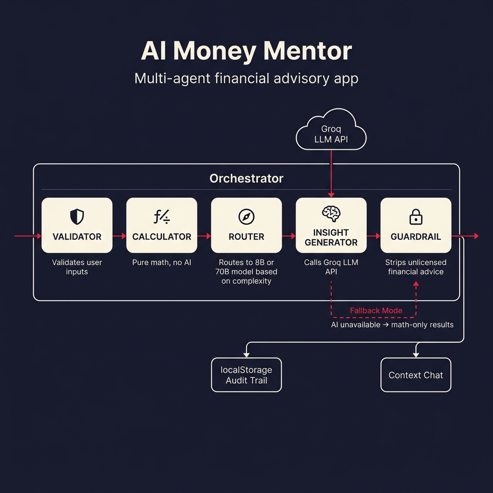
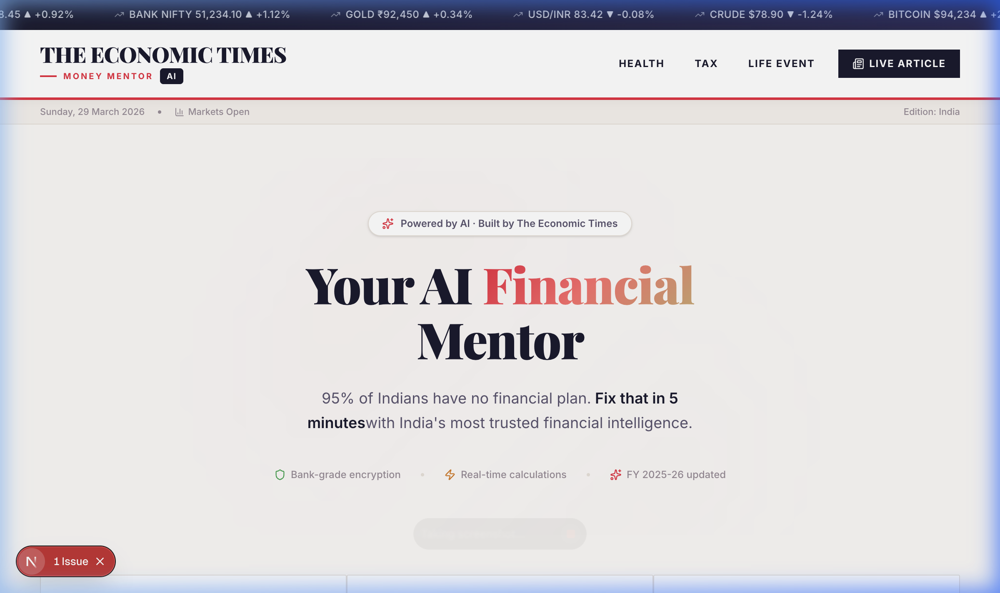
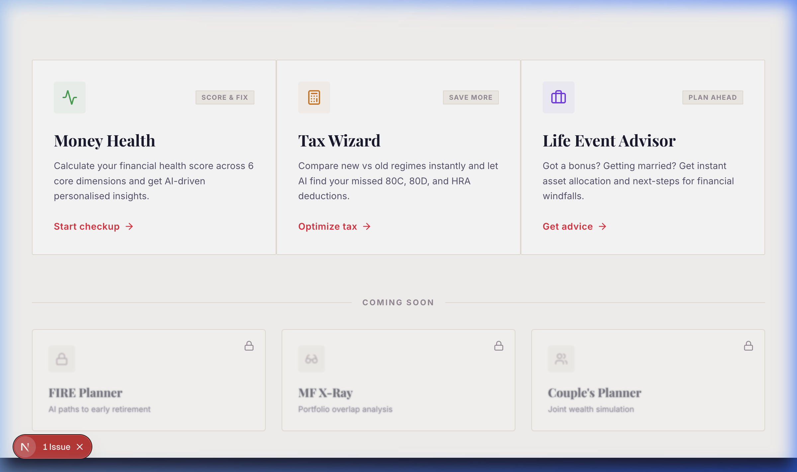
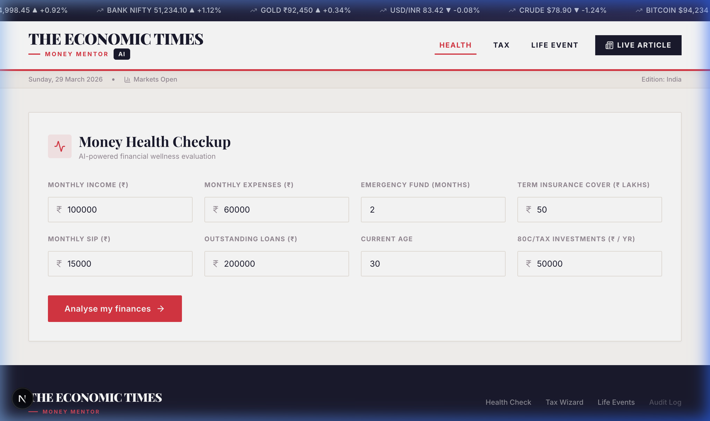
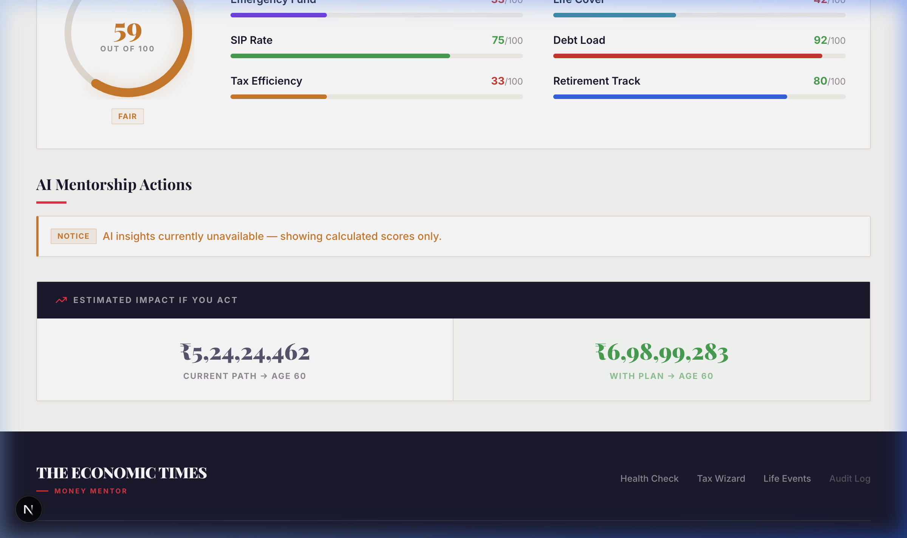
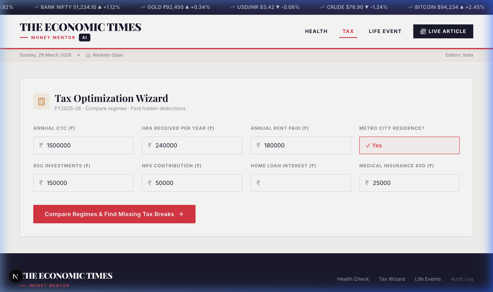
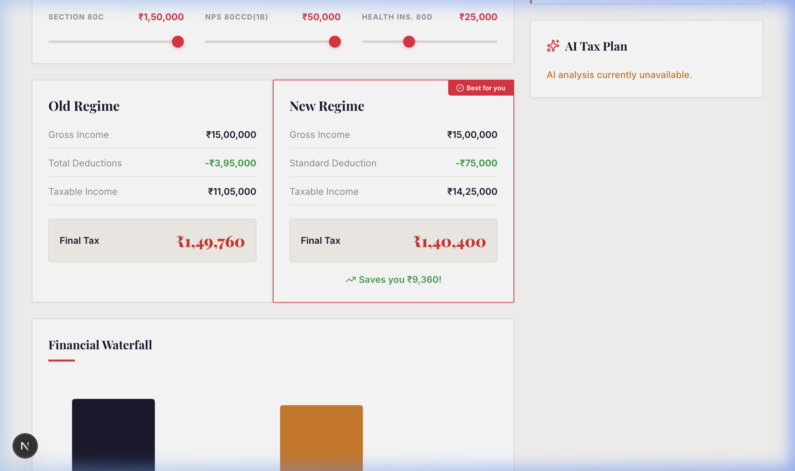
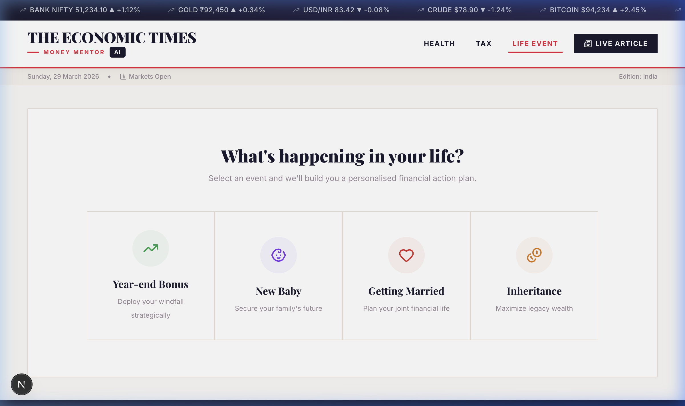
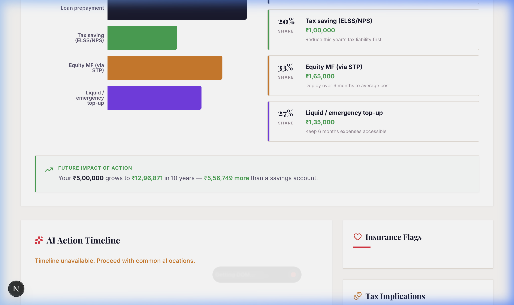
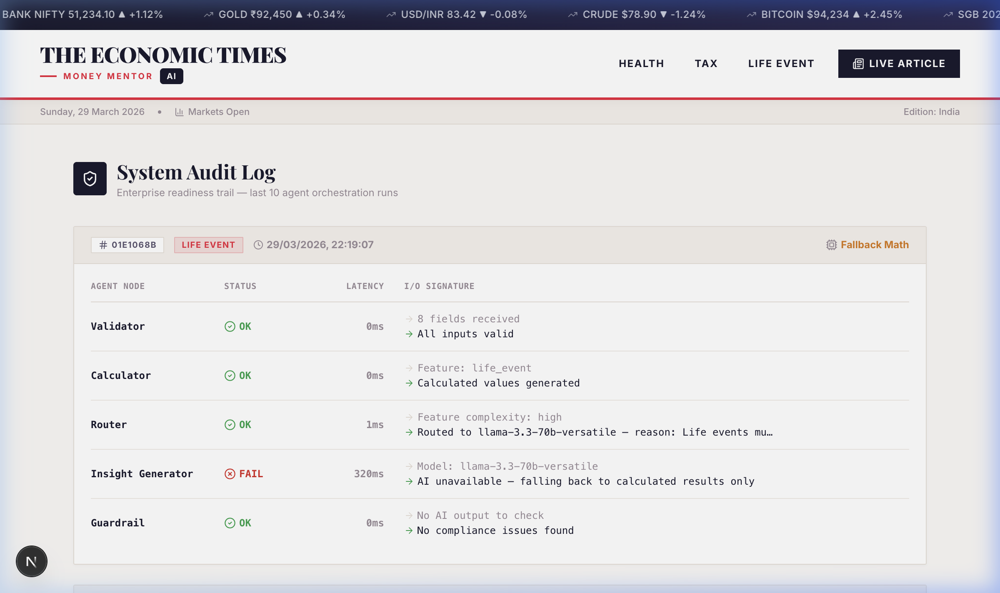

<p align="center">
  
</p>

<h1 align="center">
  💰 AI Money Mentor
</h1>

<p align="center">
  <strong>A multi-agent AI financial advisory platform built for The Economic Times</strong><br>
  Real-time tax optimization · Financial health scoring · Life-event planning
</p>

<p align="center">
  
  
  
  
  
</p>

---

## ✨ What is AI Money Mentor?

**AI Money Mentor** is an AI-powered personal finance platform that gives Indian salaried employees **instant, personalised financial advice** — no CA appointment needed.

It runs a **5-agent orchestration pipeline** that:
1. ✅ **Validates** your financial inputs
2. 🧮 **Calculates** deterministic financial results (tax, health score, allocations)
3. 🧭 **Routes** to the optimal LLM (8B for simple, 70B for complex queries)
4. 🧠 **Generates** AI-powered insights using Groq's Llama models
5. 🛡️ **Guardrails** compliance — strips directive financial language to stay SEBI-safe

> **Key Innovation:** Math always runs first. If AI is unavailable, users still get accurate financial results. The AI layer is *supplementary intelligence*, not the core engine.

---

## 📸 Screenshots

### 🏠 Homepage — Premium ET Editorial Design
<p align="center">
  
</p>

Clean serif typography, live market ticker, trust badges, and newspaper-style feature cards.

<p align="center">
  
</p>

---

### 💊 Financial Health Check
<p align="center">
  
</p>

Enter your financial details and get a **real-time health score across 6 dimensions** — emergency fund, insurance, investments, debt load, tax efficiency, and retirement readiness.

<p align="center">
  
</p>

- **ScoreRing** with glow effect and color-coded badge
- Dimension bars with per-category colors
- Wealth projection comparison (Current Path vs. With Plan → Age 60)

---

### 🧾 Tax Optimization Wizard
<p align="center">
  
</p>

Compare **Old vs New Tax Regime** side-by-side with interactive what-if sliders and a financial waterfall chart.

<p align="center">
  
</p>

- "**Best for you**" badge on the recommended regime
- AI-discovered missed deductions (80C, 80D, 80CCD, HRA)
- Long-term wealth impact of tax savings compounded at 12% over 25 years
- Shareable **ghost links** (zero-database URL encoding)

---

### 🎯 Life Event Advisor
<p align="center">
  
</p>

Select a life event (Bonus, Marriage, New Baby, Inheritance) and get an **instant asset allocation strategy** with tax implications and insurance flags.

<p align="center">
  
</p>

- Allocation bar chart + breakdown cards
- Future impact projection (10-year compounding)
- AI action timeline with deadlines
- Insurance gap flags with urgency levels

---

### 🔍 System Audit Log
<p align="center">
  
</p>

Enterprise-ready audit trail showing every agent's status, latency, and I/O signature for each session.

---

## 🏗️ Architecture

<p align="center">
  
</p>

### Agent Pipeline

| # | Agent | Type | Role |
|---|-------|------|------|
| ① | **Validator** | Deterministic | Input validation with feature-specific rules |
| ② | **Calculator** | Deterministic | Pure financial math — health score, tax comparison, asset allocation |
| ③ | **Router** | Heuristic | Routes to `llama-3.1-8b` (simple) or `llama-3.3-70b` (complex) |
| ④ | **Insight Generator** | AI / LLM | Groq API call with structured JSON prompts |
| ⑤ | **Guardrail** | Compliance | Regex filter replacing 7 categories of directive financial language |

### Error Handling Strategy

```
User Input → Validator ─[FAIL]──→ Halt + Error Message + Audit Log
                │
                ↓ [PASS]
           Calculator ──→ always succeeds (pure math)
                │
                ↓
             Router ──→ selects model tier
                │
                ↓
        Insight Generator ─[AI FAIL]──→ fallback_mode = true
                │                        (math-only results shown)
                ↓ [SUCCESS]
           Guardrail ──→ sanitize + audit log
                │
                ↓
           UI Result + Context Chat
```

---

## 📊 Impact Model

### Per-User Impact

| Metric | Value | Basis |
|--------|-------|-------|
| ⏱️ Time saved | **47 min / session** | 65 min (CA visit) − 18 min (AI session) |
| 💸 Cost reduced | **₹1,850 / session** | ₹2,000 avg CA fee − ₹1.50 API cost |
| 💰 Tax savings found | **₹38,400 / year** | Avg ₹1.28L missed deductions × 30% tax rate |

### At Scale (10K MAU)

| Metric | Monthly | Annually |
|--------|---------|----------|
| Time displaced | 7,833 hours | 94,000 hours |
| CA cost displaced | ₹2 Crore | ₹24 Crore |
| Tax savings delivered | ₹3.2 Crore | ₹38.4 Crore |
| Infrastructure cost | ₹16,700 | ₹2 Lakh |
| **ROI** | — | **₹1,917 returned per ₹1 spent** |

---

## 🚀 Quick Start

### Prerequisites
- Node.js 18+
- A [Groq API key](https://console.groq.com) (free tier works)

### Setup

```bash
# Clone the repository
git clone https://github.com/AviralMishra039/AI-Money-Mentor.git
cd ai_money_mentor

# Install dependencies
npm install

# Create environment file
echo "GROQ_API_KEY=your_groq_api_key_here" > .env.local

# Start development server
npm run dev
```

Open [http://localhost:3000](http://localhost:3000) in your browser.

> **Note:** The app works even without a Groq API key — it will run in **fallback mode** showing calculated results only (no AI insights).

---

## 🗂️ Project Structure

```
ai_money_mentor/
├── app/
│   ├── page.tsx              # Homepage with ET editorial design
│   ├── health/page.tsx       # Financial health check (6-dim scoring)
│   ├── tax/page.tsx          # Tax wizard (Old vs New regime)
│   ├── life-event/page.tsx   # Life event advisor
│   ├── article/page.tsx      # ET article with embedded AI widgets
│   ├── audit/page.tsx        # System audit log
│   ├── api/
│   │   ├── advisor/route.ts  # Groq LLM API for structured insights
│   │   └── chat/route.ts     # Context-aware follow-up chat
│   ├── globals.css           # ET design system (colors, typography, components)
│   └── Layout.tsx            # Root layout with market ticker + masthead
├── lib/
│   ├── orchestrator.ts       # 5-agent pipeline orchestrator
│   ├── calculations.ts       # Deterministic financial math
│   ├── prompts.ts            # Structured LLM prompts (health, tax, life-event)
│   ├── types.ts              # TypeScript interfaces
│   └── agents/
│       ├── validator.ts      # Input validation agent
│       ├── router.ts         # Complexity-based model router
│       ├── guardrail.ts      # Compliance filter agent
│       └── audit.ts          # Audit trail logger
├── components/
│   ├── Layout.tsx            # Masthead, ticker, footer
│   ├── ScoreRing.tsx         # SVG score visualization
│   ├── InsightCard.tsx       # AI insight cards
│   ├── AgentProgress.tsx     # Real-time agent pipeline UI
│   └── ContextChat.tsx       # Follow-up AI chat widget
└── docs/
    ├── Architecture_and_Impact_Model.html  # Printable PDF document
    ├── architecture_diagram.png
    └── screenshots/
```

---

## 🛠️ Tech Stack

| Layer | Technology | Why |
|-------|-----------|-----|
| **Framework** | Next.js 16 (Turbopack) | Server-side API routes + fast HMR |
| **Language** | TypeScript | Type safety for financial calculations |
| **Styling** | Tailwind CSS v4 + custom ET design tokens | Rapid iteration with premium aesthetics |
| **AI** | Groq Cloud (Llama 3.1/3.3) | Ultra-fast inference (~200ms) |
| **Charts** | Recharts | Declarative, composable financial visualizations |
| **Icons** | Lucide React | Consistent, tree-shakeable icon library |
| **Fonts** | Playfair Display + Inter | Editorial serif headlines + clean body text |

---

## 🔐 Environment Variables

| Variable | Required | Description |
|----------|----------|-------------|
| `GROQ_API_KEY` | Yes (for AI features) | Your Groq API key |
| `GROQ_MODEL` | No | Override default model (default: `llama-3.1-8b-instant`) |

---

## 👥 Team

Built with ❤️ for **The Economic Times** hackathon.

---

## 📄 License

This project is built for educational and demonstration purposes. The Economic Times brand elements are used under fair use for the hackathon context.
